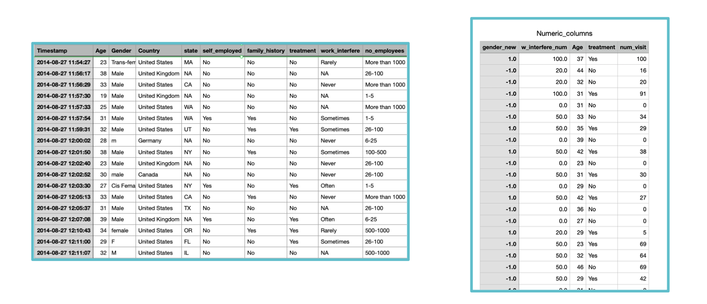
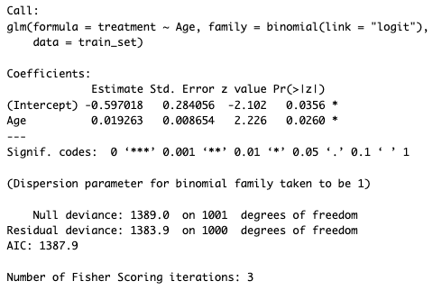
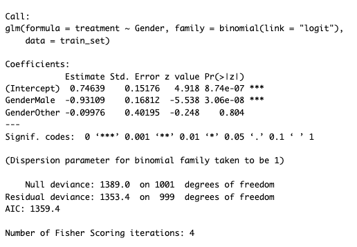

# Mental Health In Tech Survey

## About the Survey
Research was conducted to understand attitudes towards mental health and the frequency of mental health disorders in the tech workplace.  
With over 1200 responses, this 2014 survey is believed to be the largest survey done on mental health in the tech industry.

---

## About the Dataset
- **Dataset Link:** [Mental Health in Tech survey](https://www.kaggle.com/datasets/osmi/mental-health-in-tech-survey)
- **Key Variables:** 
  - Timestamp, Age, Gender, Country, State, Self_employed, Family_history
  - Treatment, Work_interfere, No_employees, Remote_work, Tech_company, Benefits, Care_options
  - Wellness_program, Seek_help, Anonymity, Leave, Mental_health_consequence
  - Phys_health_consequence, Coworkers, Supervisor, Mental_health_interview, Phys_health_interview
  - Mental_vs_physical, Obs_consequence, Comments

---

## Hypothesis
- **Hypothesis (H1):** The age distribution and gender significantly influence whether a respondent seeks treatment for mental health conditions.
- **Null Hypothesis (H0):** The age distribution and gender do not influence whether they seek treatment for mental health conditions. Any observed differences in treatment-seeking behavior between different age groups and genders are due to chance.

---

## Data Cleaning
A comparison of the data before and after cleaning.

---

## Methods Used For Analysis
- **Logistic Regression:** 
  - Used for predicting the probability of categorical outcomes (binary outcomes like yes/no).
- **Random Forest:**
  - A machine learning algorithm used for regression and classification tasks, combining the predictions of multiple decision trees to improve accuracy.

---

## Result of the Chi-Square Test
- We fail to reject the null hypothesis for gender, family history, and care options in relation to treatment.

| Column1         | Column2  | Chisquare | Pvalue    | Dof |
| --------------- | -------- | ---------:| ---------:| ---:|
| Gender          | treatment|     48.13 | 3.535e-11 |   2 |
| Self-employed   | treatment|     0.3504|    0.8393 |   2 |
| Family history  | treatment|     176.5 | 2.86e-40  |   1 |
| No_employees    | treatment|     8.763 |    0.1189 |   5 |
| Remote work     | treatment|    0.6903 |    0.406  |   1 |
| Tech company    | treatment|     1.028 |    0.3105 |   1 |
| Care options    | treatment|     93.25 | 5.631e-21 |   2 |
| Age_range       | treatment|     7.211 |    0.1252 |   4 |

---

## Logistic Regression Explanation
- **Glm:** General Linear Model.
- **Binomial:** The target variables are binary (1 or 0, yes or no).
- **Intercept:** When x is 0, the value of y. For instance, when age = 0, the log(odds of ratio) is -0.597, which corresponds to odds = 0.355.
- **Age Estimate:** The slope is 0.019. For each one-unit increase in age, the log(odds of ratio) increases by 0.019.

---

## Gender Impact on Treatment
- **Intercept:** Indicates female. The log(odds of ratio) = 0.746 -> odds = 0.679.
- **Male Estimate:** -0.931 -> odds of ratio = 0.394. This means that the likelihood of males seeking treatment is about 39% of that for females.

---

## Prediction Based on Age and Gender using logistic regression model
Accuracy score is 0.616. It means using gender and age alone to predict whether a person will seek treatment does not yield high accuracy, indicating that other factors affect this decision.

---

## Random Forest Prediction
Since the previous logistic regression model indicates that other factors might affect the decision of seeking treatment. We employ a random forest model to efficiently identify which factors might be important. After training the model, we can display the importance of each factor.

| Variable         | MeanDecreaseGini  |
| ---------------- | ----------------  |
| Age              | 44.500991         |
| Self-employed    | 8.652036          |
| Family history   | 51.521751         |
| Remote work      | 6.234320          |
| Tech company     | 4.715678          |
| Care options     | 40.339015         |

Family history has the highest MeanDecreaseGini value (51.521751), indicating it's the most important factor in the model.

Age and Care options also have high importances (44.500991 & 40.339015), suggesting it significantly influences the model's predictions.

---

## Summary of Results
- We reject the null hypothesis due to the correlation between gender and seeking treatment. Females are more likely to seek treatment compared to males and other genders.
- A model based on gender and age alone performs poorly (about 0.4 error rate) in predicting treatment-seeking behavior. Other factors, such as family history and care options in the company, likely play a crucial role.

---
